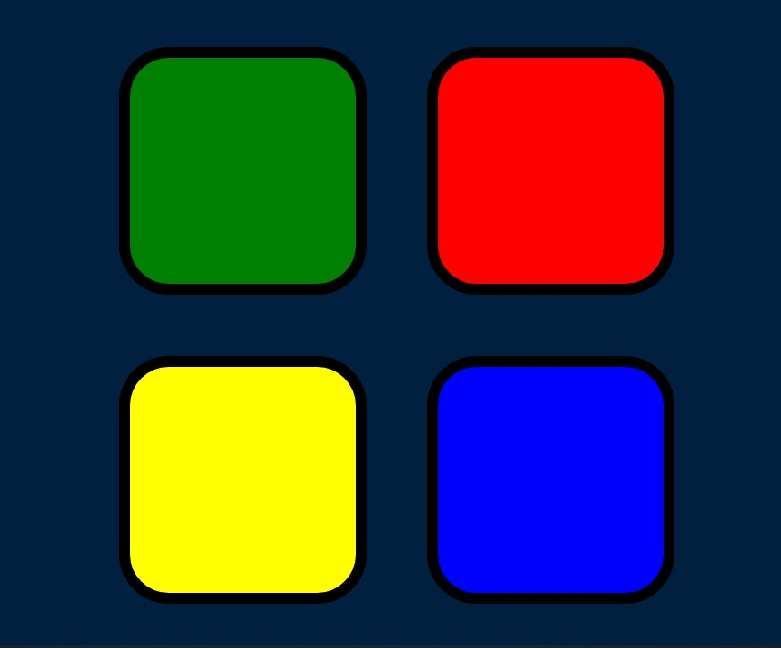

<h1>Simon Game</h1>

 This game is built using HTML, CSS and JavaScript. I made this during my Udemy Web Development course.

<h3>Instruction</h3>
<ol>
	<li>Press A key to start the game</li>
	<li>Memorise the pattern the game presents</li>
	<li>Repeat the pattern from the beginning to move to next level</li>
	<li>If Game Over, press A to restart the game</li>
</ol>